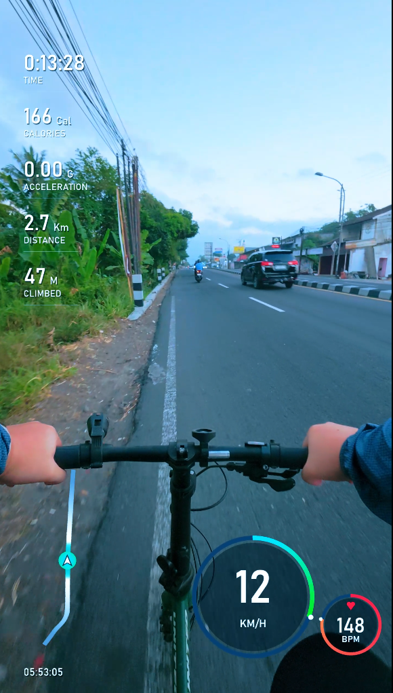

# gpx-overlay

Animated cycling telemetry overlay generator. Feed it a GPX ride recording and a time range, get a
**transparent .mov** you drop straight on top of your footage — no chroma key,
no keying artifacts.

## Result

The overlay composited over real ride footage:

<p align="center">
  
</p>

Everything is animated and synced to the GPX clock. Output is 1080×1920 (9:16) @ 30 fps,
QuickTime Animation (qtrle) with an alpha channel — roughly 75 MB and ~1 minute of render
time per clip minute.

## Designs

There are two interchangeable designs. Each is its own script; run whichever you want.
More can be added later as `render_overlay_<name>.py`.

### `render_overlay.py` — classic (with map)

- **Left stack** — duration, time (clock), acceleration (G), distance (km), climbed (m)
- **Follow map** — heading-up rotating mini-map: the route scrolls/rotates under a fixed
  arrow, route band white near you fading to grey with distance
- **Speed ring** + **heart-rate ring** — translucent glass discs; HR ring has a heart
  that pulses at your live BPM

Rings and map are lifted up and inset from the edges so they clear the
TikTok/Reels/Shorts action buttons and caption bar.

### `render_overlay_centered.py` — centered (no map, HR zones)

- **Left stack** — duration, acceleration (G), distance (km), climbed (m), time (12-hour
  with AM/PM); no separator lines
- **No map**
- **Speed ring** + **heart-rate ring** — centered as a pair (side by side, no overlap);
  the HR ring is coloured by training zone (Z1 grey → Z5 red) with a `ZONE n` label

## Prerequisites

Windows only (uses the built-in **Bahnschrift** font, included with Windows 10/11).

1. **Python 3.10+** (tested on 3.12) — `winget install Python.Python.3.12`
2. **Python packages** — `pip install pillow numpy`
3. **ffmpeg** — `winget install Gyan.FFmpeg` (or any ffmpeg on `PATH`, or point the
   `FFMPEG_PATH` environment variable at the exe)

## Usage

Both scripts take the same options — swap `render_overlay.py` for
`render_overlay_centered.py` to use the other design.

```
python render_overlay.py --gpx ride.gpx --start 05:53:00 --end 05:54:00
```

`--start` / `--end` accept **local wall-clock time** `HH:MM:SS` (matching the
overlay's on-screen clock) or plain ride-seconds. Omit both to render the whole
ride. Output is auto-named next to the GPX, e.g. `ride_overlay_055300-055400.mov`.

More options:

| Flag | Meaning |
|---|---|
| `--out clip.mov` | custom output path |
| `--png f.png --png-at 05:53:30` | render a single preview frame |
| `--alpha green` | chroma-green MP4 instead of transparent (also: `prores`, `vp9`) |
| `--tz 7` | UTC offset of the ride location (default +7) |
| `--weight 70 --age 30` | calorie-estimate inputs (Keytel HR formula) |
| `--no-intro` | skip the slide-in intro (it only plays when a clip starts at ride second 0) |

### Engagement extras (opt-in, for social clips)

All off by default — the base overlay is unchanged unless you pass these:

| Flag | Meaning |
|---|---|
| `--caption "POV: 5:53am ride to work"` | hook text, top-center, first few seconds |
| `--caption-dur 3` | how long the hook stays (seconds) |
| `--day 47` | a `DAY 47` series badge (top-right) for daily uploads |
| `--endcard` | auto stat-summary card over the final seconds (distance, max km/h, climbed, max bpm) |
| `--endcard-dur 3` | how long the end card shows (seconds) |
| `--lang en\|id` | label language for the badge / end card |

Example daily-series clip:

```
python render_overlay.py --gpx ride.gpx --start 05:53:00 --end 05:54:00 \
  --caption "POV: morning ride in Yogyakarta" --day 47 --endcard
```

### Using in CapCut

Import the `.mov`, place it on the track **above** your footage — the background is
already transparent. Do not apply chroma key / background removal.

> Why qtrle? Tested in CapCut desktop: VP9 webm alpha imports with a black
> background (alpha ignored), ProRes 4444 files are impractically large, and
> green-screen keying erodes thin text and anti-aliased edges. QuickTime Animation
> imports with working transparency.

## GPX requirements

GPX 1.1 with ~1 Hz trackpoints containing `lat`/`lon`, `<ele>`, `<time>`, and heart
rate in the Garmin TrackPointExtension (`gpxtpx:hr`) — this is what Strava exports.
Speed, distance, acceleration, climb, and HR zone are derived from those. Missing
heart rate or elevation default to 0.
